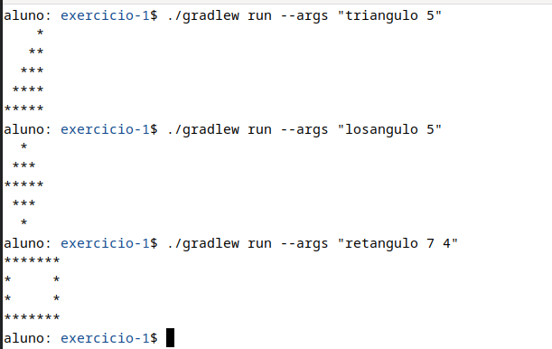

# Lista de exercícios - Revisão Java

#### Germano Dolwitsch Coelho

## Esté repositório é destinado as resoluções da lista de exercícios sobre o Java

### Exercício - 1 - Arte ASCII

Este exercício tem como objetivo mostrar na tela do usuário os formatos: triangulo, losangulo e retangulo com suas respectivas dimensões.

* Sendo que, as formas devem ser passadas como primeiro argumento da linha de comando.

* Se a forma for retangulo, ela deve obrigatóriamente conter duas medidas, sendo sua largura e altura.

* As dimensões do losangulo devem sempre ser números ímpares.

Abaixo está o exemplo de como o programa deve ser executado

